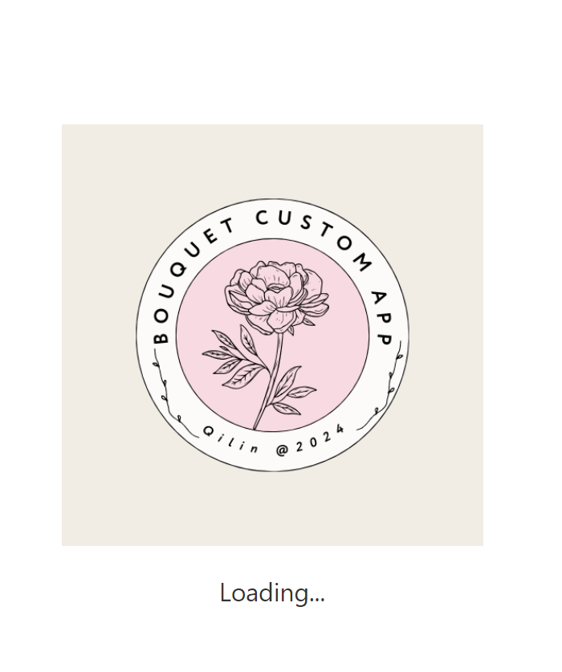
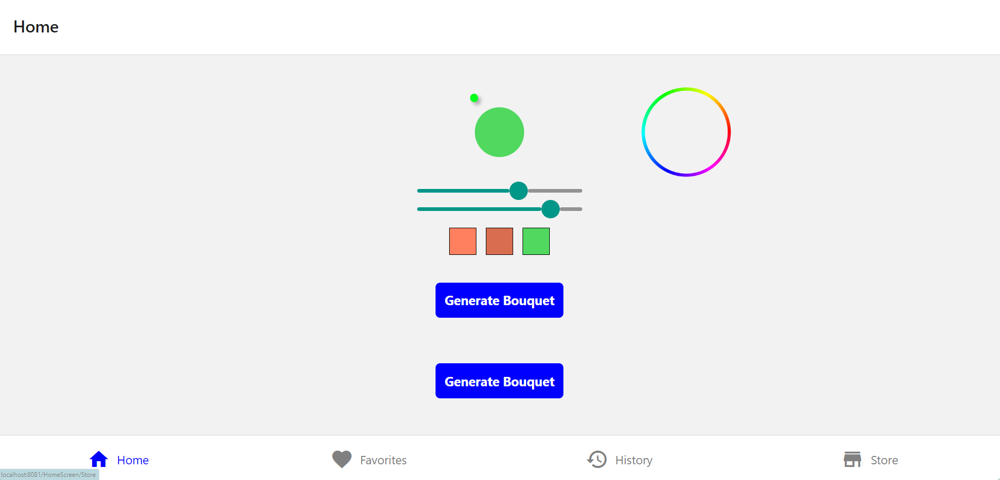
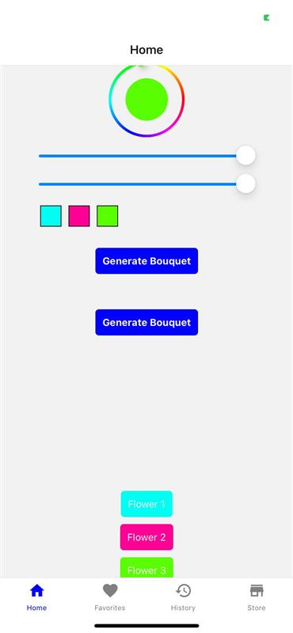
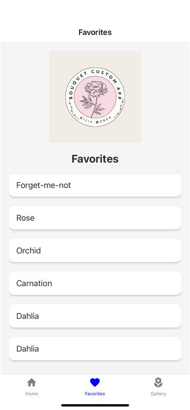
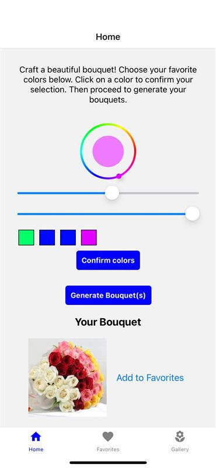
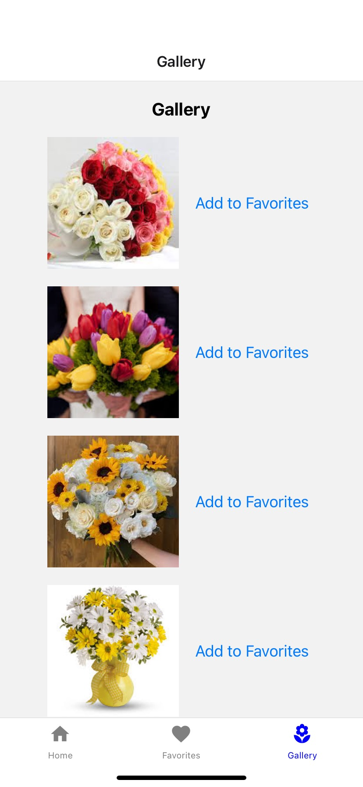
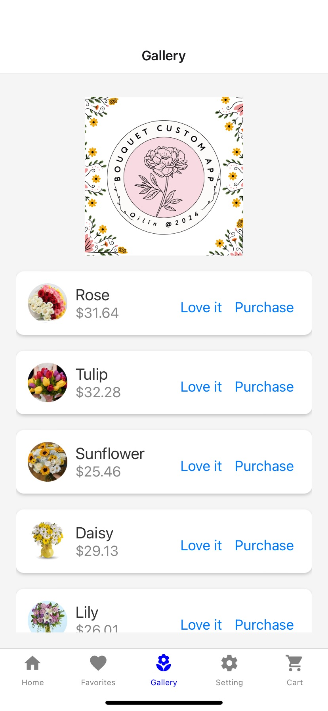
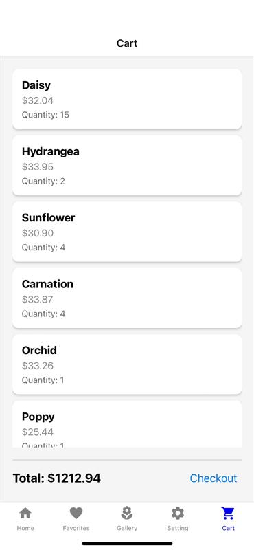
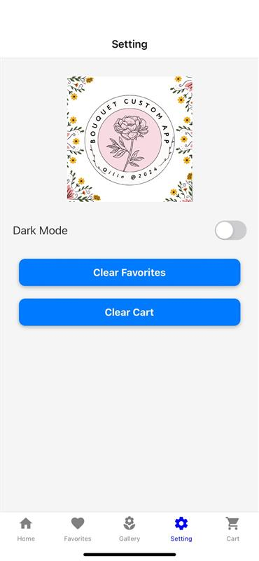
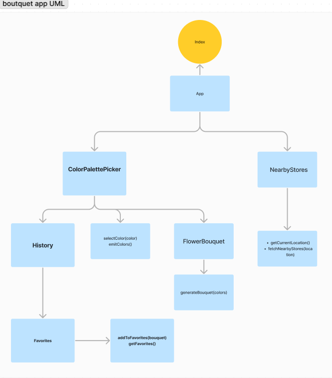

# Flower Bouquet Customizer App

## App Overview
The Flower Bouquet Customizer App allows users to create unique flower bouquets by selecting from a palette of colors. The app randomizes the types of flowers based on the selected colors and show a picture of that flower. Users can save their created bouquets to their favorites. And there is a gallery page that users can proceed with add to cart to purchases if they like.  (stretch goal) In future app versions, users could find nearby stores that sell similar bouquets.

## User Stories
1. **Palette Customization:** As a user, I want to select colors to customize my unique flower bouquet.
2. **Flower Randomization:** As a user, I want the app to randomly generate flower types based on my selected colors.
3. **Find Bouquets:** As a user, I want to find pictures of flowers that matches with that generated bouquets with mock datas (Postgres Database).
4. **Save Bouquets:** As a user, I want to save my created bouquets to history and favorites for future reference.

Stretch goal (after implementing #3):  **Find Nearby Stores:** As a user, I want to find nearby grocery stores that sell similar flower bouquets.

## Screenshots
### Day 1 

1st: Logo loading screen: 

2nd: HomeScreen: 

### Day 2:


### Day 3: 




### Day 4:



 

## Features
- **Color Palette Picker:** Choose colors for your bouquet.
- **Random Flower Generation:** Randomly generates flower types based on selected colors.
- **Save Bouquets:** Save your created bouquets to history and favorites.
- **High Fidelity Styling:** Ensures good contrast, right-sized tap targets, and an intuitive user interface.

##
- **Stretch goals:**
- **Nearby Stores:** Fetches and displays nearby grocery stores that sell similar bouquets using geolocation.
- **Register and Login screens**


## How to Use
1. **Open the App:** Scan the provided QR code to open the app on your device.
2. **Select Colors:** Use the color picker to select colors for your bouquet.
3. **Generate Bouquet:** View the randomly generated bouquet based on your selected colors.
4. **Save Bouquet:** Save your favorite bouquets to history and favorites for future reference.
5. **Stretch: Find Stores:** Allow the app to access your location to find nearby grocery stores selling similar bouquets.

## Technologies Used
- **React Native:** For building the mobile app.
- **Expo:** For development environment and QR code generation.
- **Styled-Components:** For CSS-in-JS styling.
- **Axios:** For making API requests.
- **API db:** For fetching flower pictures from DB.
- **AsyncStorage:** For saving and retrieving bouquets locally.
- **React Native Color Picker:** For color selection.

## UML Diagram


## Setup Instructions
1. **Clone the repository:**
   ```bash
   git clone https://github.com/QILINXIE02/Flower-app
   cd Flower-app

## Resources
[Material UI](https://materialui.co/icon/settings)

# Short Demo: How I Made This App

## Initial Setup:
- Started with setting up a new React Native project using Expo CLI
- Created the basic folder structure for components, screens, and utilities.

## Color Picker Integration:
- Implemented a color picker using the `react-native-color-picker` library.
- Created a `ColorPalettePicker` component that allows users to select multiple colors.

## Flower Randomization:
- Developed a utility function `generateRandomBouquet` to randomize flower types based on selected colors.
- Created a `FlowerBouquet` component to display the generated bouquet.

## State Management:
- Used React's `useState` and `useEffect` hooks for state management.
- Stored selected colors and generated bouquets in the component's state.

## Saving Bouquets:
- Implemented saving functionality using `AsyncStorage` for local storage.
- Created functions in `utils/storage.js` to save and retrieve bouquets from local storage.

## Navigation:
- Used React Navigation to set up stack and tab navigators.
- Created screens for Home, Favorites, and Gallery.

## UI/UX Design:
- Styled components using `styled-components` to ensure a consistent and attractive UI.
- Ensured the app is responsive and provides a good user experience.

## Future Enhancements:
- Planned for integrating geolocation to find nearby stores selling similar bouquets.
- Considering user authentication for personalized experiences.
